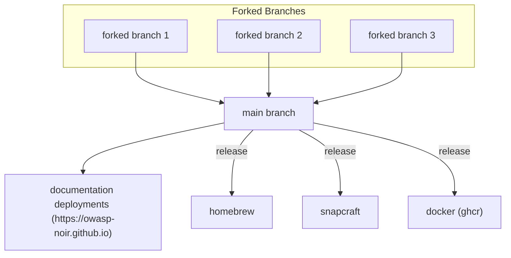

# ❤️ Contribution Guidelines

Thank you for considering contributing to our project! Here are some guidelines to help you get started and ensure a smooth contribution process.

1. Fork and Code
- Begin by forking the repository.
- Write your code within your forked repository.

2. Pull Request
- Once your contribution is ready, create a Pull Request (PR) to the main branch of the main repository.
- Provide a clear and concise description of your changes in the PR.

3. Completion
- That's it! You're done. Await feedback and further instructions from the maintainers.


```mermaid
graph TD
    subgraph Forked Branches
        fork1["forked branch 1"]
        fork2["forked branch 2"]
        fork3["forked branch 3"]
    end
    fork1 --> main["main branch"]
    fork2 --> main
    fork3 --> main

    main --> deployments["documentation deployments (https://owasp-noir.github.io)"]

    main -->|release| homebrew["homebrew"]
    main -->|release| snapcraft["snapcraft"]
    main -->|release| docker["docker (ghcr)"]
```

## 🛠️ Building and Testing
### Clone and Install Dependencies

```bash
# If you've forked this repository, clone to https://github.com/<YOU>/noir
git clone https://github.com/hahwul/noir
cd noir
shards install
```

### Build
```bash
shards build
# ./bin/noir
```

### Unit/Functional Test
```bash
crystal spec

# Want more details?
crystal spec -v
```

### Lint
```bash
crystal tool format
lib/ameba/bin/ameba.cr --fix

# Ameba installation
# https://github.com/crystal-ameba/ameba#installation
```

or

```bash
just fix
```

## 🧭 Code Structure

- spec:
  - unit_test: Unit test codes (for `crystal spec` command).
  - functional_test: Functional test codes.
- src: Contains the source code.
  - analyzer: Code analyzers for Endpoint URL and Parameter analysis.
  - detector: Code for language and framework identification.
  - models: Contains everything related to models, such as classes and structures.
- noir.cr: Main file and command-line parser.

### Adding a new detector or analyzer

Noir's analyzer stack is a three-layer design (language engine → route extractor → framework adapter). Before adding a new detector/analyzer, read:

**📖 [Analyzer Architecture](https://owasp-noir.github.io/noir/development/analyzer_architecture/)**

The doc covers how the layers fit together, which engines and extractors already exist, the two supported engine shapes, and a step-by-step walkthrough of adding a new framework (Hertz as the worked example).

Feel free to reach out to us if you have any questions or need further assistance!

## Document Contributing

Please note that [our web page](https://owasp-noir.github.io/noir/) operates based on the main branch. If you make any changes, kindly send a Pull Request (PR) to the main branch.

To ensure a smooth integration of your contributions, please follow these steps:

* Fork the repository and create your feature branch from main.
* Make your changes, ensuring they are thoroughly tested.
* Submit your PR to the main branch for review.

By doing so, you'll help us keep our project up-to-date and well-organized. Your efforts are greatly appreciated, and we're excited to see what you'll bring to the project!

### Setting up the Documentation Site

To set up the documentation site locally, follow these steps:

#### Install Hwaro

> https://hwaro.hahwul.com/start/installation/

#### Serve the Documentation Site

After installing Hwaro, you can serve the documentation site locally using the following Just task:

```sh
just docs-serve

# or

just ds
```

This will start a local server, and you can view the documentation by navigating to http://localhost:3000 in your web browser.

## ✍️ Writing for the Blog

Noir runs a small experimental blog under [`/blog/`](https://owasp-noir.github.io/noir/blog/) — a space for release deep dives, performance write-ups, framework coverage notes, design rationale, and tips that don't fit in a changelog. **Guest posts from the community are welcome** — case studies, CI integrations, framework analyses, debugging stories.

### Post layout

Each post is a page bundle under `docs/content/blog/`:

```
docs/content/blog/<post-slug>/
├── index.md           # English version
└── index.ko.md        # Korean version (optional)
```

The slug becomes the URL (`/blog/<post-slug>/`). Use lowercase, hyphen-separated words.

### Front matter

```toml
+++
title = "Your post title"
description = "One-line summary used in OG cards and the post card on /blog/."
date = "2026-05-17"
tags = ["release", "performance"]
authors = ["<your-slug>"]
template = "blog_post"
+++

Your markdown content starts here.
```

- `authors` is the taxonomy field — each string must match a key in [`docs/data/authors.yaml`](docs/data/authors.yaml). Multiple authors are allowed (`authors = ["a", "b"]`).
- `template = "blog_post"` is required so the post uses the blog layout instead of the default docs page.
- `tags` are optional but help discoverability.

### Registering yourself as an author

Add an entry to `docs/data/authors.yaml`:

```yaml
your-slug:
  name: Your Display Name
  role: "Guest Writer"                 # any short role / title you like
  bio: "One sentence about you."
  image: https://github.com/<gh-handle>.png
  links:
    - kind: github
      handle: <gh-handle>
      url: https://github.com/<gh-handle>
    # Add as many as you want — twitter, x, mastodon, bluesky,
    # linkedin, email, website (fallback for any other URL).
```

The `team: true` flag is reserved for official Noir maintainers and renders a "Team" badge — leave it off for guest entries. The same registry powers `/authors/<slug>/` (your profile page) and the author card on every post you write.

### Preview locally

```sh
just docs-serve  # or: just ds
```

Then open http://localhost:3000/blog/ and http://localhost:3000/authors/&lt;your-slug&gt;/ to see your post and profile.

### Submit

Open a PR with your post + author entry — same flow as any other change. The `📝 blog` label gets attached automatically.
