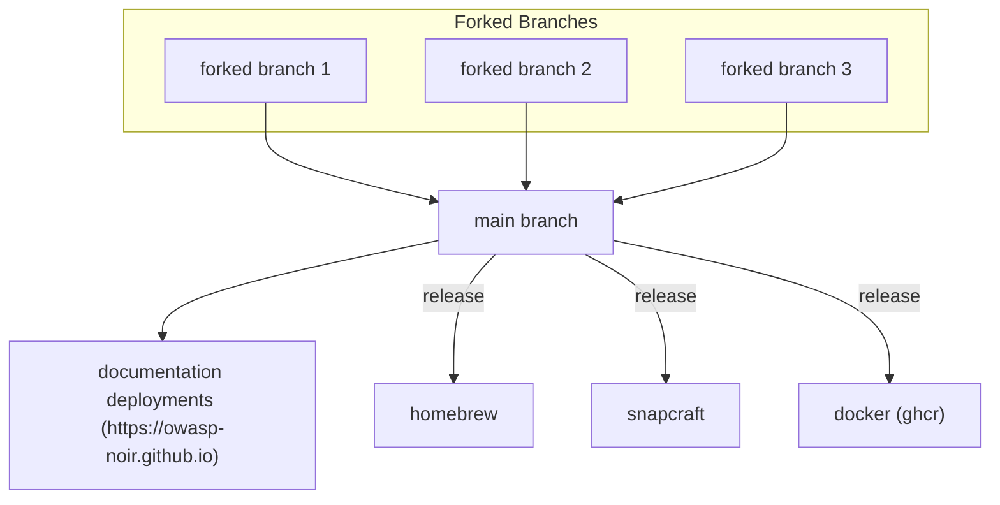

# ❤️ Contribution Guidelines

Thank you for considering contributing to our project! Here are some guidelines to help you get started and ensure a smooth contribution process.

1. Fork and Code
- Begin by forking the repository.
- Write your code within your forked repository.

2. Pull Request
- Once your contribution is ready, create a Pull Request (PR) to the main branch of the main repository.
- Provide a clear and concise description of your changes in the PR.

3. Completion
- That's it! You're done. Await feedback and further instructions from the maintainers.



## 🛠️ Building and Testing
### Clone and Install Dependencies

```bash
# If you've forked this repository, clone to https://github.com/<YOU>/noir
git clone https://github.com/hahwul/noir
cd noir
shards install
```

### Build
```bash
shards build
# ./bin/noir
```

### Unit/Functional Test
```bash
crystal spec

# Want more details?
crystal spec -v
```

### Lint
```bash
crystal tool format
ameba --fix

# Ameba installation
# https://github.com/crystal-ameba/ameba#installation
```

or 

```bash
just lint-all # MODIFIED
```

## 🧭 Code Structure

- spec: 
  - unit_test: Unit test codes (for `crystal spec` command).
  - functional_test: Functional test codes.
- src: Contains the source code.
  - analyzer: Code analyzers for Endpoint URL and Parameter analysis.
  - detector: Code for language and framework identification.
  - models: Contains everything related to models, such as classes and structures.
- noir.cr: Main file and command-line parser.

Feel free to reach out to us if you have any questions or need further assistance!

## Document Contributing

Please note that [our web page](https://owasp-noir.github.io/noir/) operates based on the main branch. If you make any changes, kindly send a Pull Request (PR) to the main branch. 

To ensure a smooth integration of your contributions, please follow these steps:

* Fork the repository and create your feature branch from main.
* Make your changes, ensuring they are thoroughly tested.
* Submit your PR to the main branch for review.

By doing so, you'll help us keep our project up-to-date and well-organized. Your efforts are greatly appreciated, and we're excited to see what you'll bring to the project!

### Setting up the Documentation Site

To set up the documentation site locally, follow these steps:

#### Install Dependencies

We use Rake tasks to manage dependencies. Run the following command to install the necessary dependencies:

```sh
just docs-install # MODIFIED
```

#### Serve the Documentation Site

After installing the dependencies, you can serve the documentation site locally using the following Rake task:

```sh
just docs-serve # MODIFIED
```

This will start a local server, and you can view the documentation by navigating to http://localhost:4000 in your web browser.