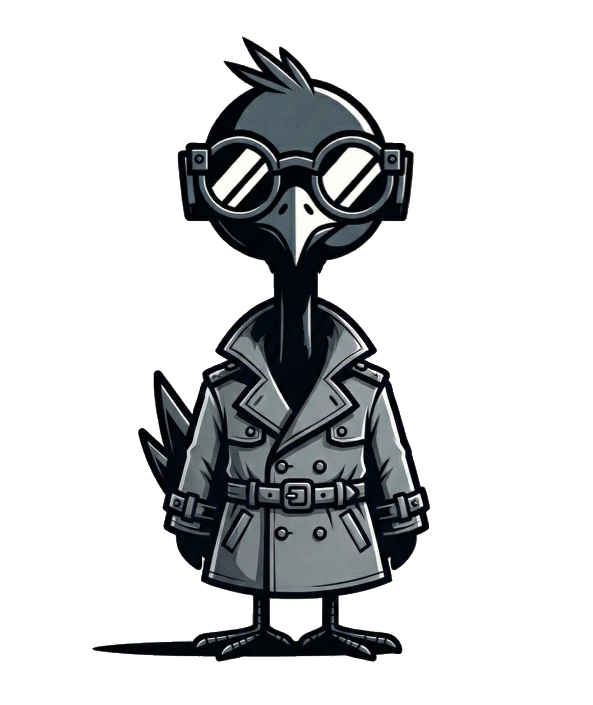

<div align="center">
  <picture>
    <source media="(prefers-color-scheme: dark)" srcset="https://github.com/owasp-noir/noir/assets/13212227/04aee7d0-c224-481b-8d79-2dbdcf3ad84b" width="500px;">
    <source media="(prefers-color-scheme: light)" srcset="https://github.com/owasp-noir/noir/assets/13212227/0577860e-3d7e-4294-8f1f-dc7b87ce2b2b" width="500px;">
    
  </picture>
  <p>An advanced hybrid analyzer that automatically detects all endpoints in your codebase, including shadow and undocumented APIs.</p>
</div>

<p align="center">
<a href="https://github.com/owasp-noir/noir/blob/main/CONTRIBUTING.md">
</a>
<a href="https://github.com/owasp-noir/noir/releases">
</a>
<a href="https://crystal-lang.org">
</a>
<a href="https://owasp.org/www-project-noir/">
</a>
</p>

<p align="center">
  <a href="https://owasp-noir.github.io/noir/">Documentation</a> •
  <a href="https://owasp-noir.github.io/noir/get_started/installation/">Installation</a> •
  <a href="#usage">Usage</a> •
  <a href="#contributing">Contributing</a>
</p>

OWASP Noir is an open-source attack surface discovery tool that automatically identifies every endpoint in your codebase through hybrid static and dynamic analysis. It finds shadow APIs, undocumented routes, and hidden security weaknesses that traditional tools miss, giving security teams and developers complete and accurate visibility into the real attack surface.

## Why Noir?

- Attack Surface Discovery: Analyzes source code to identify your application's complete attack surface, including hidden endpoints, shadow APIs, and other security blind spots.
- AI-Powered Analysis: Leverages Large Language Models (LLMs) to detect endpoints in any language or framework—even those not natively supported.
- SAST-to-DAST Bridge: Connects static code analysis with dynamic testing by providing discovered endpoints to DAST tools, enabling more comprehensive and accurate security scans.
- DevSecOps Ready: Designed for seamless integration into security pipelines with support for tools like ZAP, Burp Suite, Caido, and more.
- Multi-Format Output: Delivers results in JSON, YAML, OpenAPI Specification, and other formats for easy integration with your existing workflow.

## Usage

```bash
noir -h
```

Example
```bash
noir -b <source_dir>
```

If you use it with Github Action, please refer to this [document](/github-action) .


JSON Result
```
noir -b . -u https://testapp.internal.domains -f json -T
```

```json
{
  "endpoints": [
    {
      "url": "https://testapp.internal.domains/query",
      "method": "POST",
      "params": [
        {
          "name": "my_auth",
          "value": "",
          "param_type": "cookie",
          "tags": []
        },
        {
          "name": "query",
          "value": "",
          "param_type": "form",
          "tags": [
            {
              "name": "sqli",
              "description": "This parameter may be vulnerable to SQL Injection attacks.",
              "tagger": "Hunt"
            }
          ]
        }
      ],
      "details": {
        "code_paths": [
          {
            "path": "spec/functional_test/fixtures/crystal_kemal/src/testapp.cr",
            "line": 8
          }
        ]
      },
      "protocol": "http",
      "tags": []
    }
  ]
}
```

For more details, please visit our [documentation](https://owasp-noir.github.io/noir/) page.

## Roadmap
We plan to expand the range of supported programming languages and frameworks, and to continuously increase accuracy. Furthermore, we will leverage AI and Large Language Models (LLMs) to significantly broaden our analysis capabilities.

Initially conceived as a tool to assist with WhiteBox testing, our immediate goal remains to extract and provide endpoints from the source code within the DevSecOps Pipeline. This enables Dynamic Application Security Testing (DAST) tools to conduct more accurate and stable scans.

Looking ahead, our ambition is for our tool to evolve into a crucial bridge, seamlessly connecting source code with DAST and other security testing tools, thereby facilitating a more integrated and effective security posture.

## News & Updates

* October 2025: Presented at the OWASP Seoul Meetup.
* November 2024: Published a guest blog post ["Powering Up DAST with ZAP and Noir"](https://www.zaproxy.org/blog/2024-11-11-powering-up-dast-with-zap-and-noir/) on the ZAP blog.
* June 2024: Joined OWASP as OWASP Noir
  * Renamed the GitHub organization from noir-cr to owasp-noir
  * Transitioned to co-leadership with [@ksg97031](https://github.com/ksg97031)
* November 2023: Moved the Noir repository to the noir-cr GitHub organization.
* August 2023: Started as [@hahwul](https://github.com/hahwul)'s personal project.

## Contributing

Noir is an open-source project made with ❤️.
If you would like to contribute, please check [CONTRIBUTING.md](./CONTRIBUTING.md) and submit a Pull Request.

[](https://github.com/owasp-noir/noir/graphs/contributors)

## Mascot

|  | Our mascot is Hak (학), a crane symbolizing elegance and precision in spotting hidden flaws. In Korean, "학" means "crane," representing a sharp ally who dives deep to uncover vulnerabilities and attack surfaces in your code. <br><br> For more artwork and resources related to Hak, check out [noir-artwork repository](https://github.com/owasp-noir/noir-artwork).|
| -------------- | -------------- |
