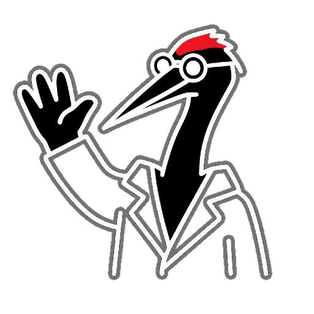

<div align="center">
  <picture>
    <source media="(prefers-color-scheme: dark)" srcset="https://github.com/owasp-noir/noir/assets/13212227/04aee7d0-c224-481b-8d79-2dbdcf3ad84b" width="500px;">
    <source media="(prefers-color-scheme: light)" srcset="https://github.com/owasp-noir/noir/assets/13212227/0577860e-3d7e-4294-8f1f-dc7b87ce2b2b" width="500px;">
    
  </picture>
  <p>Hunt every Endpoint in your code, expose Shadow APIs, map the Attack Surface.</p>
</div>

<p align="center">
<a href="https://github.com/owasp-noir/noir/blob/main/CONTRIBUTING.md">
</a>
<a href="https://github.com/owasp-noir/noir/releases">
</a>
<a href="https://crystal-lang.org">
</a>
<a href="https://owasp.org/www-project-noir/">
</a>
</p>

<p align="center">
  <a href="https://owasp-noir.github.io/noir/">Documentation</a> •
  <a href="https://owasp-noir.github.io/noir/get_started/installation/">Installation</a> •
  <a href="#usage">Usage</a> •
  <a href="#contributing">Contributing</a> •
  <a href="./CHANGELOG.md">Changelog</a>
</p>

Noir is a SAST tool that reads source code and extracts the endpoints an application exposes — paths, methods, parameters, headers, cookies, and the source files behind them. Shadow APIs, deprecated routes, and undocumented handlers come out as part of the same inventory; they aren't a separate mode.

The inventory feeds three audiences:

- **Human reviewers.** Security engineers and code auditors get a focused list of attacker-reachable entrypoints — paths, parameters, source files, tags — instead of skimming the whole repo.
- **AI auditors.** LLM-based SAST agents get the same focused list, plus per-endpoint review context (`--include callee` for 1-hop callees, `--ai-context` for guards, sinks, validators, and signals).
- **DAST tools.** ZAP, Burp Suite, and Caido get a real route list to scan, including paths they would never have reached by crawling.

## What Noir does

- **Endpoint extraction.** Static analysis across [50+ frameworks](https://owasp-noir.github.io/noir/usage/supported/language_and_frameworks/). Returns endpoints, parameters, headers, cookies, and the source files they came from.
- **LLM fallback.** Hand unsupported frameworks (or one-off custom routing) to OpenAI / Ollama / etc. when static rules don't apply.
- **Output for the next stage.** JSON, YAML, OpenAPI, SARIF, cURL, Postman, HTML — whichever format the next tool in the pipeline reads.
- **DAST integration.** Pipe directly into ZAP, Burp Suite, or Caido as a proxy target, or export OpenAPI for them to import.
- **AI SAST context.** The endpoint inventory (and, with `--include callee`, the 1-hop functions each handler invokes) is the focused context an LLM auditor needs to find attacker-reachable bugs. `--ai-context` goes further and attaches aggregated review context per endpoint — guards, callees, sinks, validators, and signals — so the LLM doesn't have to rediscover them.
- **CI/CD.** GitHub Action, SARIF output, exit codes — fits the pipeline you already have.

## Usage

```bash
noir -h
```

Example
```bash
noir -b <source_dir>
```

If you use it with Github Action, please refer to this [document](/github-action) .


For more details, please visit our [documentation](https://owasp-noir.github.io/noir/) page.

## Roadmap

Noir started as a WhiteBox testing aid: extract endpoints from source so DAST can scan them more accurately. The job has grown — the same inventory now feeds human auditors and AI SAST agents too. The goal from here is to serve all three consumers equally well: humans reviewing the code, LLMs auditing it, and DAST tools scanning it.

From here:

- Broaden language and framework coverage; keep accuracy honest with per-framework fixtures.
- Lean harder on LLMs for the cases static analysis can't reach.
- Enrich the per-endpoint review context (guards, callees, sinks, validators, signals) so human reviewers and AI auditors share the same focused view of each handler.
- Keep DAST integration first-class — OpenAPI, proxy targets, and direct hand-offs to ZAP / Burp / Caido.

## OWASP Project

OWASP Noir joined the OWASP Foundation in **June 2024**.

- Official project page: [https://owasp.org/www-project-noir/](https://owasp.org/www-project-noir/)
- OWASP Nest: [https://nest.owasp.org/organizations/owasp-noir](https://nest.owasp.org/organizations/owasp-noir)

## News & Updates

* May 2026: Released **v1.0.0** — introducing a stable 1.x line across all analyzers, taggers, passive-scan, and a brand new verb-centric CLI structure.
* May 2026: Refreshed the roadmap — Noir's goal is now to serve humans, AI auditors, and DAST tools equally as consumers of the same endpoint inventory.
* August 2025: Presented at the OWASP Seoul Meetup. ([Open Source Gardening](https://owasp-noir.github.io/noir/community/media/#featured-owasp-seoul-aug-2025-open-source-gardening))
* November 2024: Published a guest blog post ["Powering Up DAST with ZAP and Noir"](https://www.zaproxy.org/blog/2024-11-11-powering-up-dast-with-zap-and-noir/) on the ZAP blog.
* June 2024: Joined OWASP as OWASP Noir
  * Renamed the GitHub organization from noir-cr to owasp-noir
  * Transitioned to co-leadership with [@ksg97031](https://github.com/ksg97031)
* November 2023: Moved the Noir repository to the noir-cr GitHub organization.
* August 2023: Started as [@hahwul](https://github.com/hahwul)'s personal project.

## Contributing

Noir is an open-source project made with ❤️.
If you would like to contribute, please check [CONTRIBUTING.md](./CONTRIBUTING.md) and submit a Pull Request.

[](https://github.com/owasp-noir/noir/graphs/contributors)

## Mascot

|  | Our mascot is Hak (학), a crane symbolizing elegance and precision in spotting hidden flaws. In Korean, "학" means "crane," representing a sharp ally who dives deep to uncover vulnerabilities and attack surfaces in your code. <br><br> For more artwork and resources related to Hak, check out [noir-artwork repository](https://github.com/owasp-noir/noir-artwork).|
| -------------- | -------------- |
