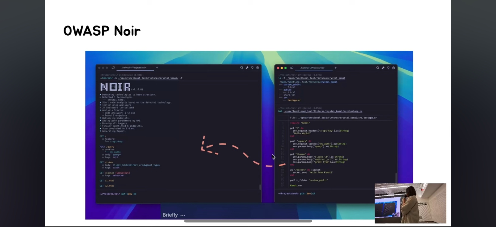

+++
title = "커뮤니티 기사 및 발표"
description = "커뮤니티의 OWASP Noir 관련 기사, 블로그 및 발표 모음."
weight = 9
sort_by = "weight"

+++

## 발표
### 하이라이트: OWASP Seoul (2025년 8월) - Open Source Gardening
OWASP Seoul 밋업에서 OWASP Noir 소개와 개발 스토리를 다룬 발표입니다.

## 기사, 블로그 및 링크
커뮤니티에서 작성한 OWASP Noir 관련 기사입니다. 여기에 추가를 원하시면 알려주세요!

* [Hello Noir 👋🏼](https://www.hahwul.com/2023/08/03/hello-noir/) by Hahwul
* [API Attack Surface Detection using Noir](https://danaepp.com/api-attack-surface-detection-using-noir) by Dana Epp
* [Exploring OWASP Noir's PassiveScan](https://www.hahwul.com/2024/11/03/passivescan-in-owasp-noir/) by Hahwul
* [Powering Up DAST with ZAP and Noir](https://www.zaproxy.org/blog/2024-11-11-powering-up-dast-with-zap-and-noir/) by the ZAP Blog
* [Enhancing OWASP Noir with AI](https://www.hahwul.com/2025/01/31/owasp-noir-x-llm/) by Hahwul
* [Awesome Crystal](https://github.com/veelenga/awesome-crystal#security)
* [Analysis Tools - Static Analysis](https://github.com/analysis-tools-dev/static-analysis#securitysast)
