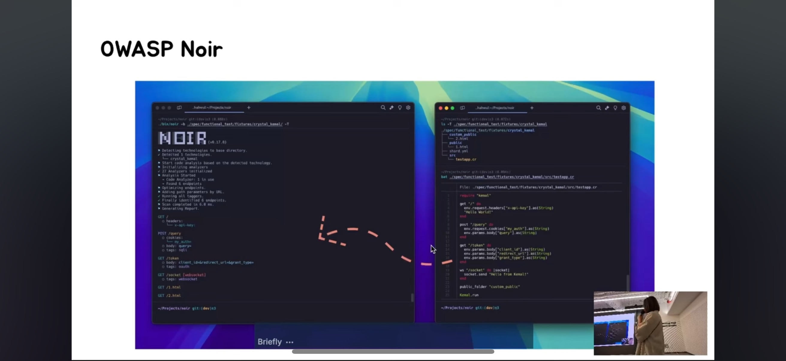

+++
title = "Community Articles & Talks"
description = "Articles, blog posts, and talks about OWASP Noir from the community."
weight = 9
sort_by = "weight"

+++

## Talks
### Featured: OWASP Seoul (Aug 2025) - Open Source Gardening
A talk introducing OWASP Noir and its development story at the OWASP Seoul meetup.

## Articles & Blogs & Links
Community-written articles about OWASP Noir. Want yours listed here? Let us know!

* [Hello Noir 👋🏼](https://www.hahwul.com/2023/08/03/hello-noir/) by Hahwul
* [API Attack Surface Detection using Noir](https://danaepp.com/api-attack-surface-detection-using-noir) by Dana Epp
* [Exploring OWASP Noir's PassiveScan](https://www.hahwul.com/2024/11/03/passivescan-in-owasp-noir/) by Hahwul
* [Powering Up DAST with ZAP and Noir](https://www.zaproxy.org/blog/2024-11-11-powering-up-dast-with-zap-and-noir/) by the ZAP Blog
* [Enhancing OWASP Noir with AI](https://www.hahwul.com/2025/01/31/owasp-noir-x-llm/) by Hahwul
* [Awesome Crystal](https://github.com/veelenga/awesome-crystal#security)
* [Analysis Tools - Static Analysis](https://github.com/analysis-tools-dev/static-analysis#securitysast)
