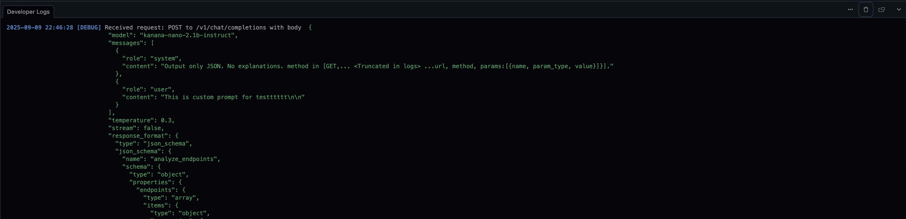

+++
title = "숨겨진 플래그로 디버그"
description = "디버깅과 실험을 위한 개발자 전용 숨겨진 플래그"
weight = 3
sort_by = "weight"

+++

`--help` 출력에 나타나지 않는 개발자 전용 플래그입니다. 이름과 동작은 사전 공지 없이 변경될 수 있습니다.

사용 가능한 플래그

- `--override-analyze-prompt` — 개별 파일 분석용 내부 ANALYZE_PROMPT를 덮어씁니다.
- `--override-llm-optimize-prompt` — 엔드포인트 최적화용 내부 LLM_OPTIMIZE_PROMPT를 덮어씁니다.
- `--override-bundle-analyze-prompt` — 번들(다중 파일) 분석용 내부 BUNDLE_ANALYZE_PROMPT를 덮어씁니다.
- `--override-filter-prompt` — 파일 필터링용 내부 FILTER_PROMPT를 덮어씁니다.

언제 사용하나요

- 분석/필터링/최적화 프롬프트 전략을 실험할 때
- 재빌드 없이 빠르게 반복 테스트할 때
- 프롬프트 변화가 결과 품질에 미치는 영향을 비교할 때

사용 팁

- 프롬프트 문자열을 따옴표로 감싸 공백과 특수문자를 보존하세요.
- 여러 줄 프롬프트는 파일로 분리하고 명령 치환(`$(cat ...)`)으로 읽어오세요.
- 작은 픽스처로 먼저 검증한 뒤 범위를 넓히세요.
- `--verbose`와 함께 사용하면 중간 단계를 확인할 수 있습니다.

예시

짧은 리터럴 문자열 (개별 파일 분석)

```bash
./bin/noir -b spec/functional_test/fixtures/crystal \
  --override-analyze-prompt 'HTTP 엔드포인트와 파라미터를 식별하고, 간결한 구조화된 결과를 반환하라.'
```

파일에서 프롬프트 읽어오기 (분석)

```bash
./bin/noir -b spec/functional_test/fixtures/crystal \
  --override-analyze-prompt "$(cat prompts/analyze_prompt.txt)"
```

LLM 최적화 프롬프트 덮어쓰기

```bash
./bin/noir -b spec/functional_test/fixtures/crystal \
  --override-llm-optimize-prompt "$(cat prompts/llm_optimize_prompt.txt)"
```

번들 분석 프롬프트 덮어쓰기

```bash
./bin/noir -b spec/functional_test/fixtures/crystal \
  --override-bundle-analyze-prompt "$(cat prompts/bundle_analyze_prompt.txt)"
```

파일 필터링 프롬프트 덮어쓰기

```bash
./bin/noir -b spec/functional_test/fixtures/crystal \
  --override-filter-prompt 'HTTP 라우트나 미들웨어를 선언할 가능성이 있는 애플리케이션 소스만 선택하라.'
```

스크린샷 예시

플래그 없이 실행:

```bash
./bin/noir -b ./spec/functional_test/fixtures/crystal/kemal --ai-provider=lmstudio --ai-model=kanana-nano-2.1b-instruct --exclude-techs kemal --cache-disable
```


--override-analyze-prompt 사용:

```bash
./bin/noir -b ./spec/functional_test/fixtures/crystal/kemal --ai-provider=lmstudio --ai-model=kanana-nano-2.1b-instruct --exclude-techs kemal --cache-disable --override-analyze-prompt "This is custom prompt for testttttt"
```



주의사항

- 숨겨진 플래그는 예고 없이 변경되거나 제거될 수 있습니다.
- 프롬프트와 LLM 동작에 따라 실행마다 출력이 달라질 수 있습니다.
- 셸이 문자를 예기치 않게 해석하면 작은따옴표 또는 파일 입력 방식을 사용하세요.
- LLM 기능을 사용하려면 관련 환경 설정(API 키 등)을 사전에 준비하세요.
