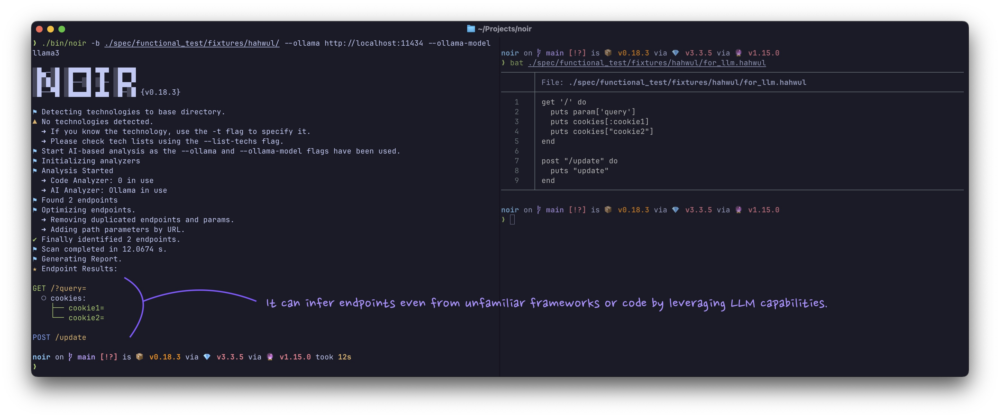

+++
title = "AI 기반 분석"
description = "Noir를 LLM 제공업체에 연결해 정적 규칙이 놓친 엔드포인트까지 찾아내는 방법입니다."
weight = 4
sort_by = "weight"

+++

Noir를 대규모 언어 모델(클라우드 API, 로컬 런타임, ACP 에이전트)에 연결하면 정적 분석기가 지원하지 않는 언어와 프레임워크에서도 엔드포인트를 찾아낼 수 있습니다.


정적 규칙이 모르는 프레임워크라도 괜찮아. 코드를 LLM에 넘기면 엔드포인트를 찾아낼 수 있어.




## 빠른 예제

OpenAI로 스캔:

```bash
noir scan . --ai-provider openai --ai-model gpt-5.5 --ai-key $OPENAI_API_KEY
```

로컬 Ollama로 스캔 (API 키 불필요):

```bash
noir scan . --ai-provider ollama --ai-model gemma4
```

ACP 에이전트로 스캔 (모델/키 불필요):

```bash
noir scan . --ai-provider acp:codex
```

## 사용법

AI 제공업체, 모델 및 API 키를 지정합니다:

```bash
noir scan . --ai-provider <PROVIDER> --ai-model <MODEL_NAME> --ai-key <YOUR_API_KEY>
```

ACP 제공자(`acp:*`)에서는 `--ai-model`이 선택 사항이며 `--ai-key`가 보통 필요하지 않습니다:

```bash
noir scan . --ai-provider acp:codex
```

### 명령줄 플래그

| 플래그 | 설명 |
|---|---|
| `--ai-provider` | 제공업체 접두사 (예: `openai`, `ollama`, `acp:codex`) 또는 사용자 정의 API URL |
| `--ai-model` | 모델 이름 (예: `gpt-5.5`), `acp:*`에서는 선택 사항 |
| `--ai-key` | API 키 (`NOIR_AI_KEY` 환경 변수로도 설정 가능) |
| `--ai-agent` | 에이전트 기반 AI 워크플로우 활성화 (반복적 도구 호출 루프) |
| `--ai-agent-max-steps` | AI 에이전트 루프 최대 단계 수 (기본값: `20`) |
| `--ai-no-optimize` | LLM 옵티마이저 단계를 건너뜀 |
| `--ai-dry-run` | AI 분석기가 보낼 파일, 요청 수, 토큰 추정치만 출력하고 아무것도 전송하지 않음 (LLM 필터와 LLM 최적화도 건너뜀) |
| `--ai-include-sensitive` | 기본으로 보내지 않는 자격 증명 파일(`.env*`, `*.pem`, `*.key`, `id_rsa*`, `.npmrc`, `*.tfvars` 등)도 전송 |
| `--ai-native-tools-allowlist` | 네이티브 도구 호출 허용 제공업체 목록 (쉼표 구분, 기본값: `openai,xai,github`) |
| `--ai-max-token` | AI 요청 최대 토큰 수 (선택 사항) |
| `--ai-max-requests` | 실행당 최대 AI HTTP 요청 수, 재시도 포함 (기본값: 무제한). 남은 파일은 커버리지 공백으로 보고됩니다 |
| `--ai-scope` | AI 분석기로 보낼 파일: `all` (기본값) 또는 정적 분석기가 이미 엔드포인트를 찾은 파일을 건너뛰는 `unmatched`. `--ai-agent` 에는 적용되지 않음 |
| `--cache-disable` | LLM 응답 캐시 비활성화 |
| `--cache-clear` | 실행 전 LLM 캐시 삭제 |

### 지원되는 AI 제공업체

Noir는 다음 AI 제공업체 프리셋을 지원합니다:

| 접두사 | 기본 호스트 |
|---|---|
| `openai` | `https://api.openai.com` |
| `xai` | `https://api.x.ai` |
| `github` (레거시) | `https://models.github.ai` |
| `azure` | `https://models.inference.ai.azure.com` |
| `openrouter` | `https://openrouter.ai/api/v1` |
| `vllm` | `http://localhost:8000` |
| `ollama` | `http://localhost:11434` |
| `lmstudio` | `http://localhost:1234` |
| `acp:codex` | `npx @zed-industries/codex-acp` |
| `acp:gemini` | `gemini --experimental-acp` |
| `acp:claude` | `npx @zed-industries/claude-agent-acp` |

사용자 정의 제공업체는 전체 API URL을 사용합니다: `--ai-provider=http://my-custom-api:9000`.

`azure` 프리셋이 쓰던 공용 호스트는 상위에서 종료되었습니다. 대신 사용할 리소스별 URL은 [Azure AI](@/usage/ai_providers/azure/index.ko.md) 문서를 참고하세요.

GitHub Models는 2026년 7월 30일 종료되었습니다. 기존 설정을 위해 `github` 레거시 프리셋은 이 표에 남아 있지만, 새 스캔에서는 사용할 수 없습니다. 마이그레이션 안내는 [GitHub Models 제공업체(종료)](@/usage/ai_providers/github_marketplace/index.ko.md)를 참고하세요.

원본 ACP/에이전트 stderr 로그가 필요하면 `NOIR_ACP_RAW_LOG=1`을 설정합니다.

### 환경 변수

| 변수 | 설명 |
|---|---|
| `NOIR_AI_KEY` | API 키. `--ai-key`를 넘기지 않았을 때 사용됩니다 |
| `NOIR_AI_TIMEOUT` | 제공업체 응답 대기 시간(초, 기본값 `300`) |
| `NOIR_AI_CONNECT_TIMEOUT` | 연결 자체의 대기 시간(초, 기본값 `10`) |
| `NOIR_ACP_RAW_LOG` | `1`이면 원본 ACP/에이전트 stderr 로그를 출력 |
| `HTTPS_PROXY` / `HTTP_PROXY` / `NO_PROXY` | AI 요청을 `http://` 프록시로 보냅니다(소문자 이름도 인식). 루프백 호스트는 항상 직접 연결합니다 |
| `SSL_CERT_FILE` | 신뢰할 CA 번들. 사설 CA로 서명된 제공업체나 TLS 가로채기 프록시에 사용합니다 |

연결 실패, 요청 한도 초과(HTTP 429), 일시적인 게이트웨이 오류가 발생한 요청은
백오프를 두고 최대 3회까지 재시도하며, 제공업체가 `Retry-After`를 보내면 그 값을
따릅니다. 연결된 뒤 응답 대기 시간이 초과된 요청은 모델이 아직 생성 중이었다는
뜻이므로 재시도하지 않습니다. 느린 로컬 모델에서 큰 번들 생성에 5분 이상 걸린다면
`NOIR_AI_TIMEOUT`을 늘리세요. 스캔이 끝나면 요청 수, 캐시 적중 수, 그리고
제공업체가 알려 준 경우 대략적인 입력/출력 토큰 수를 담은 `AI usage:` 줄이
출력됩니다.

## 작동 방식


flowchart TB
    Start([AI 분석 시작]) --> InitAdapter[LLM 어댑터 초기화]
    InitAdapter --> ProviderCheck{제공자 타입?}

    ProviderCheck -->|OpenAI/xAI/등| GeneralAdapter[General Adapter<br/>OpenAI 호환 API]
    ProviderCheck -->|Ollama/Local| OllamaAdapter[Ollama Adapter]
    ProviderCheck -->|ACP 에이전트| ACPAdapter[ACP Adapter<br/>Codex/Gemini/Claude/Custom]

    GeneralAdapter --> FileSelection
    OllamaAdapter --> FileSelection
    ACPAdapter --> FileSelection

    FileSelection[파일 선택] --> FileCount{파일 개수?}

    FileCount -->|≤ 10개 파일| AnalyzeAll[모든 파일 분석]
    FileCount -->|> 10개 파일| LLMFilter[LLM 기반 필터링]

    LLMFilter --> CacheCheck1{캐시 있음?}
    CacheCheck1 -->|예| UseCached1[캐시된 필터 사용]
    CacheCheck1 -->|아니오| FilterLLM[FILTER 프롬프트로<br/>LLM 호출]
    FilterLLM --> StoreCache1[캐시에 저장]
    UseCached1 --> TargetFiles
    StoreCache1 --> TargetFiles

    TargetFiles[선택된 대상 파일] --> BundleCheck{대량 파일 및<br/>토큰 제한?}

    AnalyzeAll --> BundleCheck

    BundleCheck -->|예| BundleMode[번들 분석 모드]
    BundleCheck -->|아니오| SingleMode[단일 파일 모드]

    BundleMode --> CreateBundles[토큰 제한 내에서<br/>파일 번들 생성]
    CreateBundles --> ParallelBundles[번들 동시 처리]

    ParallelBundles --> BundleLoop{각 번들마다}
    BundleLoop --> CacheCheck2{캐시 있음?}
    CacheCheck2 -->|예| UseCached2[캐시된 분석 사용]
    CacheCheck2 -->|아니오| BundleLLM[BUNDLE_ANALYZE<br/>프롬프트로 LLM 호출]
    BundleLLM --> StoreCache2[캐시에 저장]
    UseCached2 --> ParseEndpoints1
    StoreCache2 --> ParseEndpoints1
    ParseEndpoints1[응답에서<br/>엔드포인트 파싱] --> BundleLoop
    BundleLoop -->|완료| Combine

    SingleMode --> FileLoop{각 파일마다}
    FileLoop --> CacheCheck3{캐시 있음?}
    CacheCheck3 -->|예| UseCached3[캐시된 분석 사용]
    CacheCheck3 -->|아니오| AnalyzeLLM[ANALYZE 프롬프트로<br/>LLM 호출]
    AnalyzeLLM --> StoreCache3[캐시에 저장]
    UseCached3 --> ParseEndpoints2
    StoreCache3 --> ParseEndpoints2
    ParseEndpoints2[응답에서<br/>엔드포인트 파싱] --> FileLoop
    FileLoop -->|완료| Combine

    Combine[모든 엔드포인트 결합] --> LLMOptCheck{LLM 최적화<br/>활성화?}

    LLMOptCheck -->|예| FindCandidates[최적화 후보 찾기]
    FindCandidates --> OptLoop{각 후보마다}
    OptLoop --> OptimizeLLM[OPTIMIZE 프롬프트로<br/>LLM 호출]
    OptimizeLLM --> ApplyOpt[엔드포인트에<br/>최적화 적용]
    ApplyOpt --> OptLoop
    OptLoop -->|완료| FinalResults

    LLMOptCheck -->|아니오| FinalResults[최종 최적화 결과]

    FinalResults --> End([종료])

    style Start fill:#e1f5e1
    style End fill:#e1f5e1
    style LLMFilter fill:#fff4e1
    style FilterLLM fill:#e1f0ff
    style BundleLLM fill:#e1f0ff
    style AnalyzeLLM fill:#e1f0ff
    style OptimizeLLM fill:#e1f0ff
    style CacheCheck1 fill:#ffe1e1
    style CacheCheck2 fill:#ffe1e1
    style CacheCheck3 fill:#ffe1e1
    style UseCached1 fill:#e1ffe1
    style UseCached2 fill:#e1ffe1
    style UseCached3 fill:#e1ffe1


### 주요 구성 요소

#### LLM 어댑터 레이어
제공자 독립적 어댑터: **General** (OpenAI 호환 API), **Ollama** (네이티브 `/api/generate`), **ACP** (`acp:codex` 등 에이전트 런타임).

#### LLM 파일 필터링
파일이 10개를 넘는 프로젝트에서는 LLM이 엔드포인트를 포함할 가능성이 높은 파일을 먼저 골라냅니다.

#### 번들 분석
파일을 토큰 제한 내의 번들로 묶어 동시에 처리해, 대규모 코드베이스에서도 처리 속도를 유지합니다.

#### 응답 캐싱
LLM 응답은 디스크에 캐시됩니다 (SHA256 키). 위치는 `~/.config/noir/cache/ai/`(또는 `$NOIR_HOME/cache/ai/`, Windows 는 `%APPDATA%\noir\cache\ai\`)이며 `noir cache info` 로 확인할 수 있습니다. `--cache-disable` 또는 `--cache-clear`로 제어합니다.

#### LLM 옵티마이저
AI 분석기만 찾은 엔드포인트에 대한 후처리 단계입니다. 경로 파라미터 문법을 정규화하고(`:id`를 `{id}`로) 파라미터 타입을 바로잡습니다. 리터럴 경로나 파라미터 이름을 바꾸는 재작성은 버립니다. 정적 분석기가 찾은 라우트는 보내지 않습니다. 요청은 동시에 최대 4개, 스캔당 최대 100개입니다. `--ai-no-optimize`로 끌 수 있습니다.
