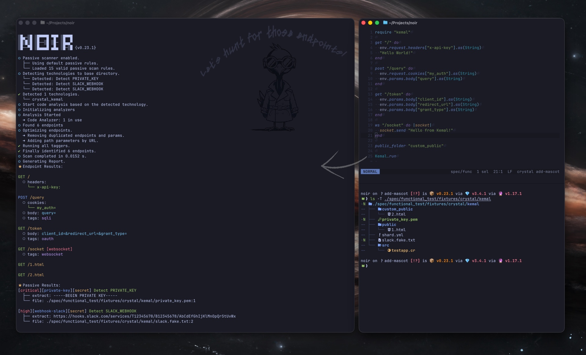

+++
title = "개요"
description = "OWASP Noir는 정적 분석으로 엔드포인트를 식별하는 공격 표면 탐지 도구입니다."
weight = 1
sort_by = "weight"

+++

Noir는 소스 코드를 분석하여 Shadow API와 문서화되지 않은 경로를 포함한 API 엔드포인트를 발견하는 공격 표면 탐지 도구입니다. 발견된 엔드포인트를 동적 테스트 도구에 직접 전달하여 SAST와 DAST를 연결합니다.

## 주요 기능

- **공격 표면 발견** — 소스 코드에서 숨겨진 엔드포인트, Shadow API, 문서화되지 않은 경로를 탐지
- **다중 언어** — 하나의 도구로 50개 이상의 언어와 프레임워크를 지원
- **AI 기반** — LLM을 활용하여 미지원 프레임워크에서도 엔드포인트를 탐지
- **SAST-DAST 연결** — ZAP, Burp Suite, Caido 등 DAST 도구에 결과를 직접 전달
- **유연한 출력** — JSON, YAML, OpenAPI, SARIF, cURL 등 다양한 형식으로 내보내기

[GitHub](https://github.com/owasp-noir/noir) | [OWASP 프로젝트 페이지](https://owasp.org/www-project-noir)

## 작동 방식

Noir는 [Crystal](https://crystal-lang.org)로 작성되었으며 다음 단계로 코드를 처리합니다:

1. **탐지기**가 코드베이스의 기술 스택을 식별
2. **분석기**가 코드를 파싱하여 엔드포인트와 파라미터를 추출
3. **LLM 분석기**가 AI를 사용하여 미지원 프레임워크의 엔드포인트를 발견
4. **패시브 스캐너 & 태거**가 취약점을 식별하고 컨텍스트 태그를 추가
5. **전달**이 결과를 외부 도구(ZAP, Burp 등)로 전송
6. **출력 빌더**가 원하는 형식의 보고서를 생성

## 기여하기

Noir는 오픈 소스이며 모든 기여를 환영합니다. [기여 가이드](https://github.com/owasp-noir/noir/blob/main/CONTRIBUTING.md)를 참고하세요.

### 기여자

