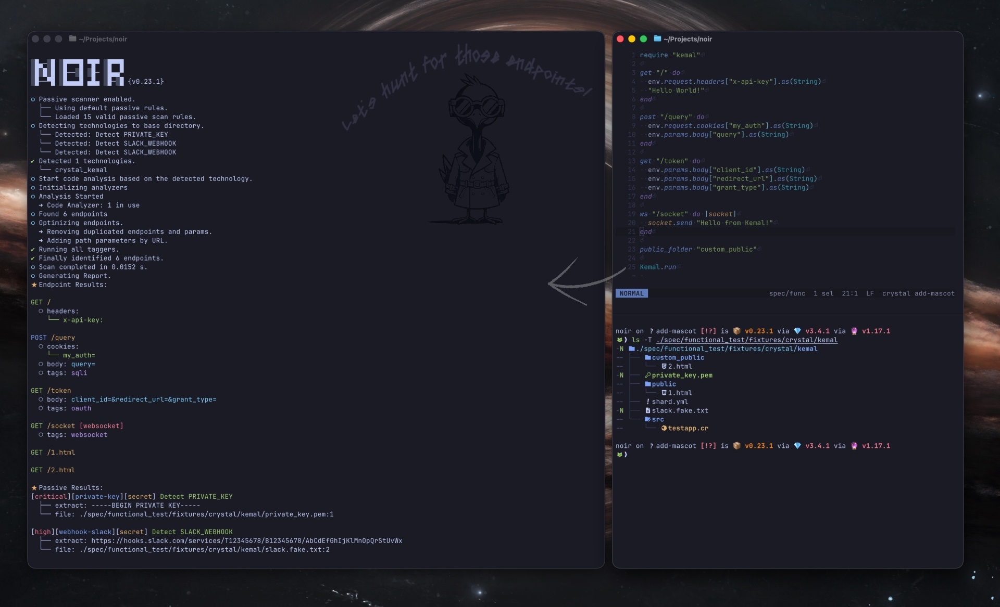

+++
title = "Noir란?"
description = "OWASP Noir는 정적 분석으로 엔드포인트를 식별하는 공격 표면 탐지 도구입니다."
weight = 1
sort_by = "weight"

+++


안녕! 나는 Noir의 마스코트 Hak이야. Noir가 어떤 도구인지 소개할게.


Noir는 오픈 소스 공격 표면 탐지 도구입니다. 소스 코드를 읽고 Shadow API와 문서화되지 않은 경로를 포함한 모든 API 엔드포인트를 발견합니다.

보안 팀은 Noir를 통해 공격자가 찾을 만한 것들 — 잊혀진 엔드포인트, 노출된 파라미터, 코드 리뷰에서 놓친 숨겨진 경로 — 을 미리 찾습니다. 개발자는 API 문서를 정확하게 유지하고 테스트 파이프라인에 엔드포인트 데이터를 공급하는 데 활용합니다.

## Noir로 무엇을 할 수 있나요?

**숨겨진 것을 찾습니다.** 소스 코드를 정적 분석하여 모든 엔드포인트, 파라미터, 헤더, 쿠키를 추출합니다 — 아무도 문서화하지 않은 것까지 포함해서.

**어떤 스택이든 지원합니다.** 단일 바이너리로 Crystal, Go, Java, JavaScript, Kotlin, PHP, Python, Ruby, Rust, Swift 등 50개 이상의 프레임워크를 지원합니다. 플러그인이나 언어별 설정이 필요 없습니다.

**AI를 활용합니다.** Noir가 네이티브로 지원하지 않는 프레임워크의 경우, LLM(OpenAI, Ollama 등)을 연결하면 AI가 코드를 분석해줍니다.

**SAST와 DAST를 연결합니다.** 소스 코드에서 엔드포인트를 발견(SAST)한 후 ZAP, Burp Suite, Caido에 직접 전달하여 동적 테스트(DAST)를 수행합니다. DAST 도구가 알지 못하는 엔드포인트를 놓치는 문제를 해결합니다.

**어떤 형식으로든 내보냅니다.** JSON, YAML, OpenAPI 명세, CI/CD용 SARIF, cURL 명령, HTML 보고서, Postman 컬렉션 등 워크플로에 필요한 형식으로 결과를 출력합니다.

## 어떻게 작동하나요?

Noir를 소스 코드에 실행하면 자동으로:

1. 프로젝트가 사용하는 언어와 프레임워크를 **탐지**
2. 코드를 **분석**하여 엔드포인트, 파라미터, 헤더를 추출
3. 원하는 형식으로 결과를 **보고**


flowchart LR
    SourceCode:::highlight --> Detectors

    subgraph Detectors
        direction LR
        Detector1 & Detector2 & Detector3 --> |Condition| PassiveScan
    end

    PassiveScan --> |Results| BaseOptimizer

    Detectors --> |Techs| Analyzers

    subgraph Analyzers
        direction LR
        CodeAnalyzers & FileAnalyzer & LLMAnalyzer
        CodeAnalyzers --> |Condition| Minilexer
        CodeAnalyzers --> |Condition| Miniparser
    end
   subgraph Optimizer
       direction LR
       BaseOptimizer[Optimizer] --> LLMOptimizer[LLM Optimizer]
       LLMOptimizer[LLM Optimizer] --> OptimizedResult
       OptimizedResult[Result]
   end

    Analyzers --> |Condition| Deliver
    Analyzers --> |Condition| Tagger
    Deliver --> 3rdParty
    BaseOptimizer --> OptimizedResult
    OptimizedResult --> OutputBuilder
    Tagger --> |Tags| BaseOptimizer
    Analyzers --> |Endpoints| BaseOptimizer
    OutputBuilder --> Report:::highlight

    classDef highlight fill:#000,stroke:#333,stroke-width:4px;


## 기여하기

Noir는 오픈 소스이며 모든 기여를 환영합니다. [기여 가이드](https://github.com/owasp-noir/noir/blob/main/CONTRIBUTING.md)를 참고하세요.

### 기여자

---

**다음**: [Noir 설치](@/get_started/installation/index.md)
