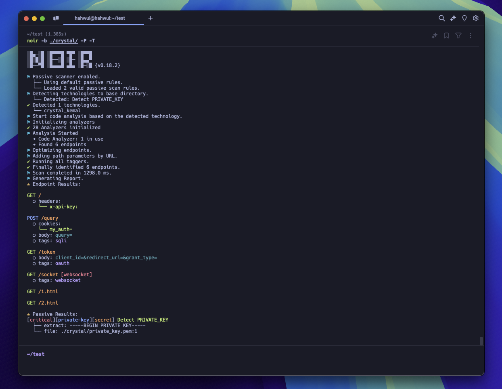

+++
title = "Step 3: Your First Scan"
description = "Run your first scan with Noir and explore the results."
weight = 3
sort_by = "weight"

+++

> **Goal**: Scan a codebase and understand the output.

## 1. Run a Scan

Point Noir at your project directory:

```bash
noir -b /path/to/your/app
```

Or scan the current directory:

```bash
noir -b .
```



Noir automatically detects the technologies used and extracts endpoints.

## 2. Check What Was Detected

See which technologies Noir found in your project:

```bash
noir -b . --include-techs
```

Want to see the full list of supported technologies?

```bash
noir --list-techs
```

## 3. Try Different Output Formats

The default output is a table. Try switching formats:

```bash
# JSON for scripting and automation
noir -b . -f json

# YAML for human-readable review
noir -b . -f yaml

# OpenAPI spec for API documentation
noir -b . -f oas3

# cURL commands to test endpoints immediately
noir -b . -f curl -u https://your-target.com
```

## 4. Save Results to a File

```bash
noir -b . -f json -o results.json
```

## 5. Customize Your Output

Include source file paths to trace where endpoints were found:

```bash
noir -b . --include-path
```

Combine options:

```bash
noir -b . --include-path --include-techs -f json -o results.json
```

## 6. Filter Technologies

If your project has many frameworks, you can focus the scan:

```bash
# Scan only specific frameworks
noir -b . --techs rails,django

# Skip frameworks you don't care about
noir -b . --exclude-techs express
```

## Useful Flags

| Flag | Description |
|---|---|
| `-b <path>` | Base directory to scan |
| `-f <format>` | Output format (json, yaml, oas3, curl, etc.) |
| `-o <file>` | Save output to a file |
| `-u <url>` | Set base URL for cURL/HTTPie output |
| `--include-path` | Show source file paths |
| `--include-techs` | Show detected technologies |
| `--techs` | Scan only these technologies |
| `--exclude-techs` | Skip these technologies |
| `--verbose` | Show detailed log output |
| `--no-log` | Suppress all log messages |
| `--help` | Show full help |

---

You've completed the Getting Started guide! Here's what to explore next:

- **[Configurations](@/usage/configurations/configuration_file/index.md)** — Set up a config file so you don't have to repeat flags
- **[Output Formats](@/usage/output_formats/_index.md)** — Explore all available output formats
- **[Passive Scan](@/usage/passive_scan/_index.md)** — Enable passive security scanning to find vulnerabilities
- **[AI Power](@/get_started/ai_power/index.md)** — Use AI to detect endpoints in unsupported frameworks
