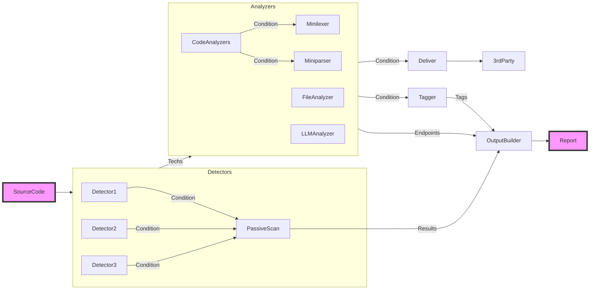

+++
title = '개요'
weight = 1
icon = "circle"
aliases = ['/introdution/index.html']
+++

OWASP 느와르는 화이트박스 보안 테스트 및 보안 파이프라인 강화를 위해 공격 표면을 식별하는 데 특화된 오픈 소스 프로젝트입니다.

[Github](https://github.com/owasp-noir/noir)
[OWASP](https://owasp.org/www-project-noir)

## 느와르란 무엇인가?

느와르는 공격 표면 식별, 화이트박스 보안 테스트 강화, 보안 파이프라인 최적화에 전념하는 오픈 소스 프로젝트입니다. 포괄적인 보안 분석을 위해 소스 코드 내에서 API 엔드포인트, 웹 엔드포인트 및 기타 잠재적인 진입점을 찾는 데 탁월합니다.

이 도구는 [Crystal](https://crystal-lang.org)을 사용하여 개발되었습니다. 2023년 8월 hahwul의 개인 프로젝트[^1]로 시작하여 2024년 6월 [hahwul](https://github.com/hahwul)과 [ksg](https://github.com/ksg97031)가 공동으로 이끄는 OWASP 프로젝트[^2]가 되었습니다.

[^1]: [안녕하세요 느와르 👋🏼](https://www.hahwul.com/2023/08/03/hello-noir/)
[^2]: [OWASP 느와르에 오신 것을 환영합니다](https://github.com/orgs/owasp-noir/discussions/336)

## 작동 방식

느와르는 탐지기, 분석기, 전달기, 미니렉서/미니파서[^3], 출력 빌더, 수동 스캔 및 태거[^4] 등 여러 주요 구성 요소로 구성됩니다. 이러한 구성 요소는 상호 작용하고 함께 작동하여 소스 코드를 효과적으로 분석합니다. 이 프로세스를 통해 소스 코드 내에서 엔드포인트, 매개변수, 헤더 등을 식별하는 데 도움이 됩니다.

[^3]: 미니렉서와 미니파서는 소스 코드 내의 다양한 요소를 식별하기 위해 코드 분석에 사용되는 파서 및 토크나이저입니다.
[^4]: 태거는 식별된 문제에 관련 태그를 할당하여 쉽게 분류하고 관리할 수 있도록 합니다.

## 프로젝트 정보
### 라이선스
OWASP 느와르는 [MIT 라이선스](https://github.com/owasp-noir/noir/blob/main/LICENSE)로 배포됩니다.

### 기여

오픈 소스 프로젝트는 커뮤니티의 힘으로 번창합니다. 작은 기여에서부터 주요 기여에 이르기까지 모든 기여자에게 감사를 표하고 싶습니다. 기여에 관심이 있으시면 이 문서를 확인하십시오.

모든 기여가 중요하다고 생각하며 이 프로젝트를 더 좋게 만드는 데 들이는 시간과 노력에 감사드립니다. 오타 수정, 새로운 기능 추가 또는 문서 개선 등 귀하의 도움은 매우 중요합니다. 커뮤니티의 일원이 되어 주셔서 감사합니다!

시작하려면 [기여 가이드](https://github.com/owasp-noir/noir/blob/main/CONTRIBUTING.md)의 지침을 따르기만 하면 됩니다. 첫 기여를 원활하고 즐겁게 만드는 데 도움이 되는 유용한 팁과 지침으로 가득 차 있습니다.

즐거운 기여 되세요!

#### 느와르의 기여자분들께 감사드립니다 ♥️

*수동 스캔 규칙 기여자*

### 행동 강령
OWASP 느와르는 환영하는 커뮤니티를 조성하기 위해 최선을 다하고 있습니다.

GitHub 리포지토리에서 [행동 강령](https://github.com/owasp-noir/noir/blob/main/CODE_OF_CONDUCT.md)을 확인하십시오.

## 도움말 및 피드백

항상 피드백을 환영합니다. GitHub [토론](https://github.com/orgs/owasp-noir/discussions) 또는 [문제](https://github.com/owasp-noir/noir/issues) 페이지를 통해 생각, 제안 또는 문제를 보고해 주십시오.
