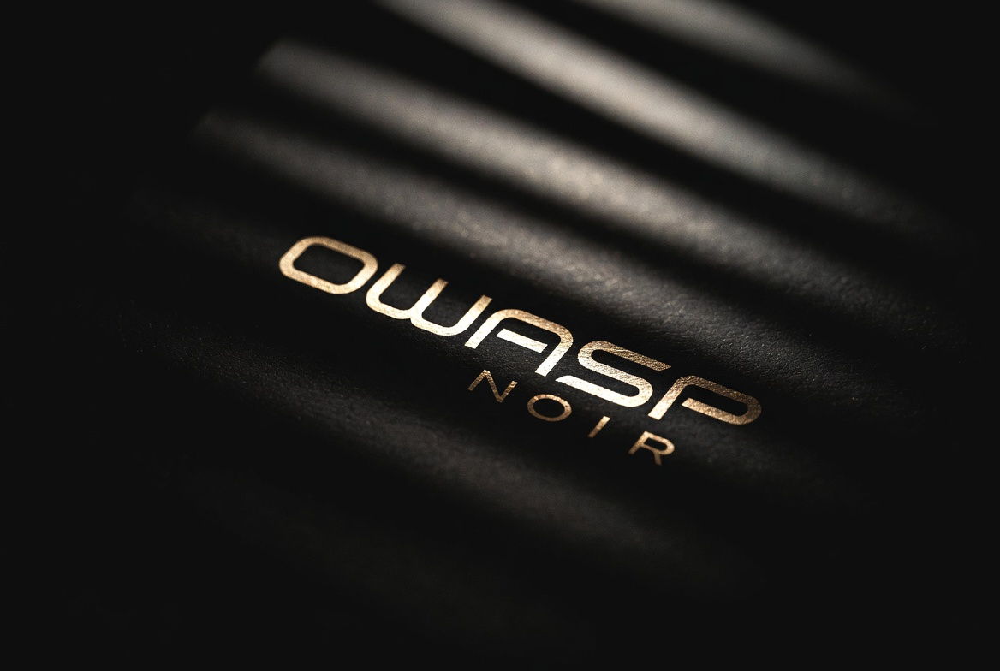

+++
title = "아트워크"
description = "OWASP Noir 공식 로고, 마스코트 및 시각적 리소스."
weight = 4
sort_by = "weight"

+++

## 제공되는 자료

*   **공식 로고**: 다양한 형식과 색상 조합
*   **마스코트**: 공식 마스코트 디자인 및 일러스트레이션
*   **브랜드 가이드라인**: Noir 브랜딩 사용법
*   **기타 리소스**: 프레젠테이션 및 문서용 시각적 자산

## 저장소

**[OWASP Noir 아트워크 저장소](https://github.com/owasp-noir/noir-artwork)**

## 기여하기

새 아트워크 제안이나 개선 사항이 있다면 아트워크 저장소에 이슈나 토론을 열어주세요.
