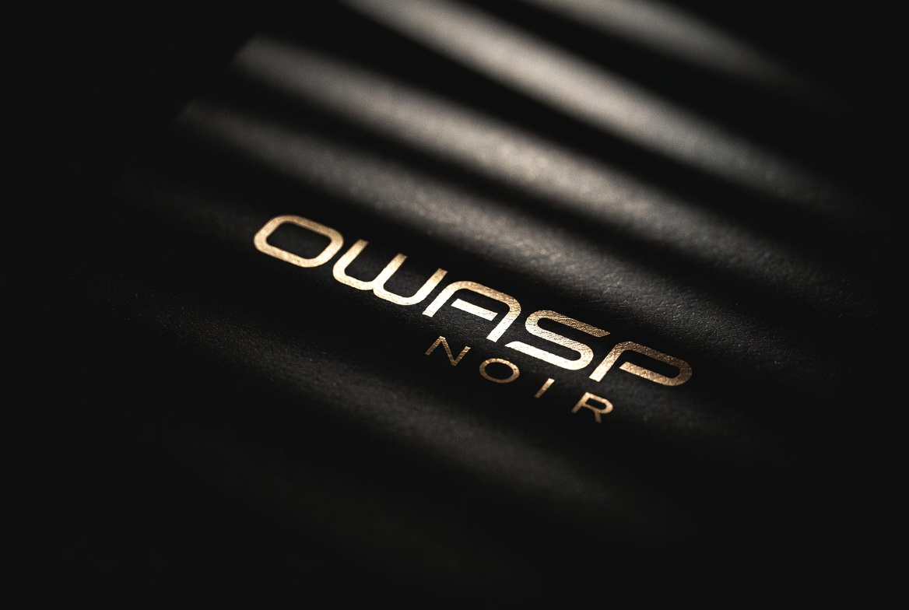

+++
title = "Artwork"
description = "Official OWASP Noir logos, mascots, and visual resources."
weight = 4
sort_by = "weight"

+++

## What's Available

*   **Official Logos**: Various formats and color schemes
*   **Mascots**: Official mascot designs and illustrations
*   **Brand Guidelines**: Proper usage of Noir branding
*   **Other Resources**: Visual assets for presentations and documentation

## Repository

**[OWASP Noir Artwork Repository](https://github.com/owasp-noir/noir-artwork)**

## Contributing

Open an issue or discussion in the artwork repository to suggest new artwork or improvements.
