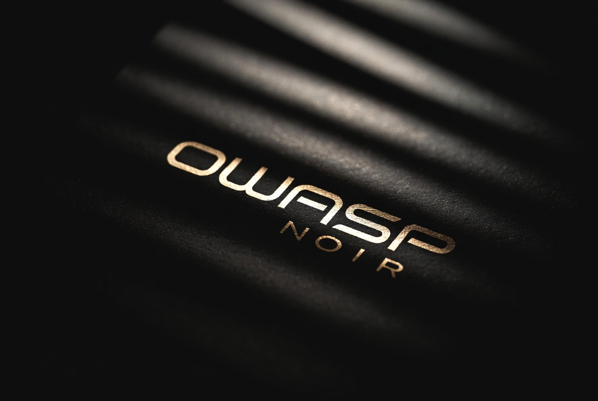

+++
title = "Artwork"
description = "Official OWASP Noir logos, mascots, and visual resources."
weight = 4
sort_by = "weight"

+++


Every pose of me lives in the artwork repository. The set below is what these docs use.




## What's Available

*   **Official Logos**: Various formats and color schemes
*   **Mascots**: Official mascot designs and illustrations
*   **Wallpapers**: Desktop wallpapers featuring Noir artwork
*   **Other Resources**: Visual assets for presentations and documentation

## Repository

**[OWASP Noir Artwork Repository](https://github.com/owasp-noir/noir-artwork)**

## Contributing

Open an issue in the artwork repository, or start a thread in the [project discussions](https://github.com/orgs/owasp-noir/discussions), to suggest new artwork or improvements.
