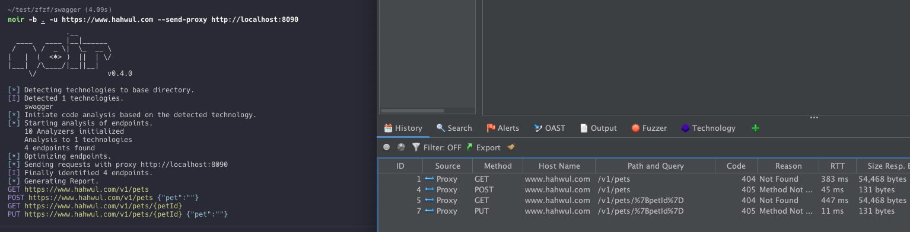
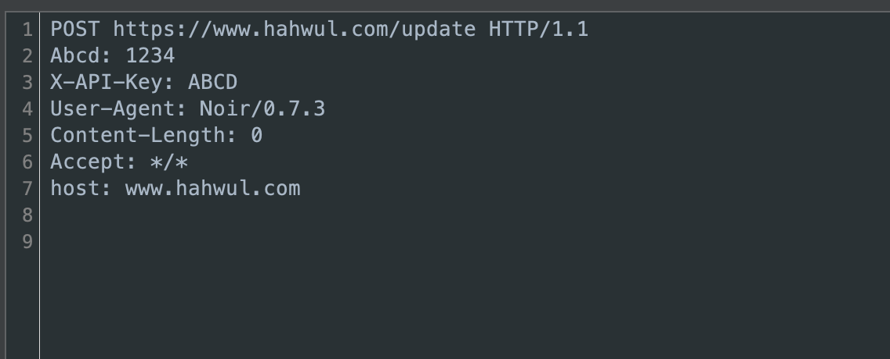
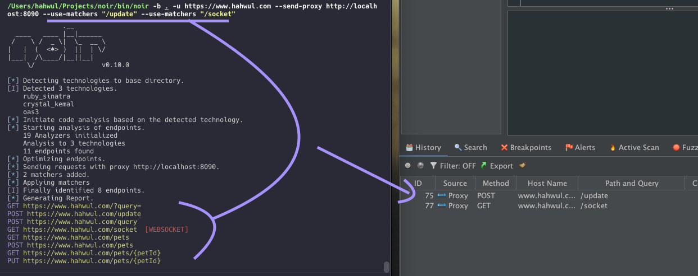

+++
title = "다른 도구로 결과 전송하기"
description = "발견된 엔드포인트를 Burp Suite, ZAP, Elasticsearch로 전송합니다."
weight = 1
sort_by = "weight"

+++

발견된 엔드포인트를 Burp Suite, ZAP, Elasticsearch 같은 보안 도구로 직접 전송하여 추가 분석에 활용할 수 있습니다.

## 사용법

관련 플래그는 아래와 같습니다.

*   `--send-req` — 웹 요청으로 전송
*   `--send-proxy http://proxy...` — HTTP 프록시를 통해 전송
*   `--send-es http://es...` — Elasticsearch로 전송
*   `--with-headers X-Header:Value` — 사용자 정의 헤더 추가
*   `--use-matchers string` — 일치하는 엔드포인트만 전송 (URL, 메서드, 또는 메서드:URL)
*   `--use-filters string` — 일치하는 엔드포인트 제외 (URL, 메서드, 또는 메서드:URL)

### 프록시로 전송

Burp Suite나 ZAP 같은 프록시로 모든 엔드포인트를 보냅니다.

```bash
noir -b ./source --send-proxy http://localhost:8080
```



### 사용자 정의 헤더 추가

인증 토큰 등 커스텀 헤더를 함께 보낼 수 있습니다.

```bash
noir -b ./source --send-proxy http://localhost:8080 --with-headers "Authorization: Bearer your-token"
```



### 필터링 및 매칭

매처와 필터를 사용하면 원하는 엔드포인트만 골라서 전송할 수 있습니다.

#### URL 기반 필터링
"api"를 포함하는 엔드포인트만 보냅니다.

```bash
noir -b ./source --send-proxy http://localhost:8080 --use-matchers "api"
```

#### 메서드 기반 필터링
GET 요청만 보냅니다.

```bash
noir -b ./source --send-proxy http://localhost:8080 --use-matchers "GET"
```

POST 요청을 제외합니다.

```bash
noir -b ./source --send-proxy http://localhost:8080 --use-filters "POST"
```

#### 메서드와 URL 조합
API 엔드포인트에 대한 POST 요청만 보냅니다.

```bash
noir -b ./source --send-proxy http://localhost:8080 --use-matchers "POST:/api"
```

관리자 페이지에 대한 GET 요청을 제외합니다.

```bash
noir -b ./source --send-proxy http://localhost:8080 --use-filters "GET:/admin"
```

#### 지원되는 HTTP 메서드
GET, POST, PUT, DELETE, PATCH, HEAD, OPTIONS, TRACE, CONNECT (대소문자 구분 안함)

#### 다중 패턴

여러 매처나 필터를 동시에 사용할 수 있습니다.

```bash
noir -b ./source --send-proxy http://localhost:8080 --use-matchers "GET" --use-matchers "POST:/api"
```


