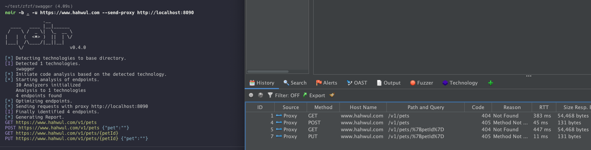
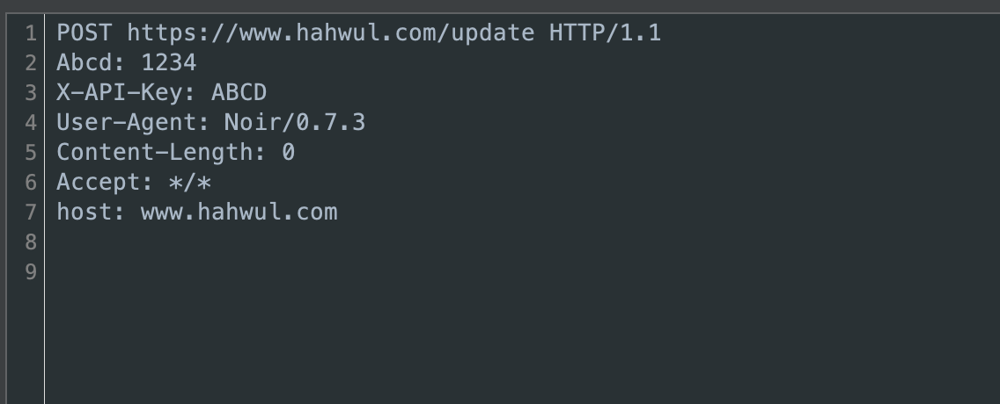
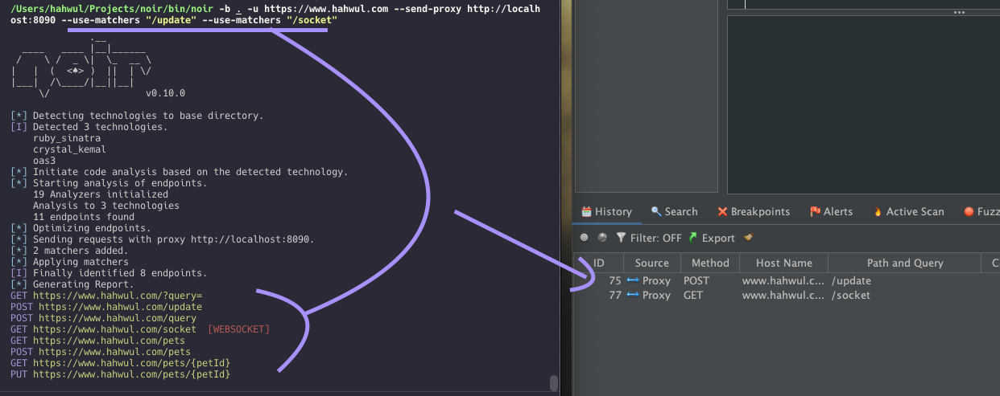

+++
title = "Delivering Results to Other Tools"
description = "Probe endpoints through Burp/ZAP, or export them to Elasticsearch or a webhook."
weight = 1
sort_by = "weight"

+++

Noir splits "delivering results" into two distinct families:

- **PROBE**: fire HTTP requests at the endpoints noir just discovered (active replay, optionally through a proxy like Burp Suite or ZAP).
- **EXPORT**: ship the endpoint catalog to an external data store (Elasticsearch, OpenSearch, or any webhook receiver) as data, with no HTTP traffic to the endpoints themselves.


Probe replays, export ships. Pick the one that matches where the results should end up.


## Probe

Relevant flags:

| Flag | Purpose |
| --- | --- |
| `--probe` | Fire HTTP requests at each discovered endpoint (needs `-u`) |
| `--probe-via URL` | Route probes through this proxy URL |
| `--probe-header VAL` | Add a header to every probe (repeatable) |
| `--probe-match VAL` | Only probe endpoints matching the pattern (URL, method, or `method:URL`) |
| `--probe-skip VAL` | Skip endpoints matching the pattern |

`--probe` and `--probe-via` are independent. Passing both sends every endpoint twice — once through the proxy and once directly — which doubles the load on the target. Pass only `--probe-via` if you just want the traffic in your proxy.

### Path templates

A discovered route like `/users/{id}` cannot be requested literally, so noir fills the placeholder before probing **read-only verbs only** (GET, HEAD, OPTIONS). Numeric-looking names (`id`, `page`, `*_id`, …) get `1`; everything else gets `noir`.

POST, PUT, PATCH and DELETE keep the literal template. Filling them would turn a harmless 404 into a real write — `DELETE /users/1` against a live record — so noir does not do it for you. Through a proxy the template still arrives, and you can edit and replay it deliberately.

Override the value with `--pvalue path=...`, which applies to every verb:

```bash
noir scan ./source -u http://localhost:3000 --probe --pvalue path=id=42
```

Reported output always keeps the original template; only the outbound request is concretized.

### Replay through a proxy

Send every endpoint through a local Burp/ZAP proxy so its scanner picks them up.

```bash
noir scan ./source -u http://localhost:3000 --probe-via http://localhost:8080
```

The proxy port is required. `--probe-via http://localhost` is rejected rather than guessed, because a proxy URL without a port cannot be routed and probes would otherwise go straight to the target instead. A bare `host:port` (the form `curl -x` takes) is accepted and read as `http://host:port`.



### Custom headers

Attach an auth token or any other header to every probe.

```bash
noir scan ./source -u http://localhost:3000 \
  --probe-via http://localhost:8080 \
  --probe-header "Authorization: Bearer your-token"
```



These headers go to the `-u` target and nowhere else. Most endpoints are paths that noir joined onto `-u`, but an endpoint that already carried its own scheme and host in the source — an OAS `servers:` entry, a HAR capture, a hosted-backend URL — keeps that host, and the host came from the code you are scanning. Those endpoints are still probed; your headers are not attached, and noir names the host once so you can see what was withheld:

```
▲ Probe: --probe-header values withheld from https://collector.example.com — it is not the --url target.
```

Export destinations (`--export-es`, `--export-webhook`) are unaffected — you named those hosts yourself, so `--probe-header` still authenticates them.

### Match / skip

Narrow the set of endpoints sent through the proxy. Patterns accept a URL substring, an HTTP method (case-insensitive), or `method:URL` combined.

```bash
# Only API endpoints
noir scan ./source -u http://localhost:3000 --probe-via http://localhost:8080 --probe-match "api"

# Only GET requests
noir scan ./source -u http://localhost:3000 --probe-via http://localhost:8080 --probe-match "GET"

# Skip POST requests
noir scan ./source -u http://localhost:3000 --probe-via http://localhost:8080 --probe-skip "POST"

# POST requests to /api only
noir scan ./source -u http://localhost:3000 --probe-via http://localhost:8080 --probe-match "POST:/api"

# Skip GET requests to /admin
noir scan ./source -u http://localhost:3000 --probe-via http://localhost:8080 --probe-skip "GET:/admin"
```

Supported HTTP methods: GET, POST, PUT, DELETE, PATCH, HEAD, OPTIONS, TRACE, CONNECT, QUERY.

Multiple `--probe-match` / `--probe-skip` flags compose:

```bash
noir scan ./source -u http://localhost:3000 \
  --probe-via http://localhost:8080 \
  --probe-match "GET" --probe-match "POST:/api"
```



## Export

Push the endpoint catalog to an external data store. Categorically different from probing: no traffic hits the endpoints themselves.

| Flag | Purpose |
| --- | --- |
| `--export-es URL` | Index the catalog in Elasticsearch |
| `--export-opensearch URL` | Same, for OpenSearch (identical wire protocol for this shape) |
| `--export-webhook URL` | POST the catalog as one JSON document to any HTTP receiver |

### Elasticsearch / OpenSearch

Pass the full document endpoint. Noir POSTs to exactly the URL you give it and does not append an index or `_doc` path of its own:

```bash
noir scan ./source --export-es http://localhost:9200/noir/_doc
```

A portless `http://` URL defaults to port 9200. A portless `https://` URL keeps the scheme default instead, because managed clusters (AWS OpenSearch Service, Elastic Cloud) and TLS reverse proxies listen on 443.

Authentication reuses `--probe-header` — despite the name, those headers are attached to export requests too:

```bash
noir scan ./source --export-es https://my.cloud.es.io/noir/_doc \
  --probe-header "Authorization: ApiKey <base64-key>"
```

### Webhook

POSTs the whole catalog as a single JSON document:

```bash
noir scan ./source --export-webhook https://hooks.example.com/noir
```

The body carries three fields:

| Field | Contents |
| --- | --- |
| `endpoints` | the same array `-f json` would have written |
| `endpoint_count` | number of entries in `endpoints` |
| `noir_version` | the noir version that produced the document |

Slack incoming webhooks, Discord webhook endpoints, Zapier/n8n triggers and custom internal receivers all accept arbitrary JSON bodies, so one contract covers the common destinations. If a receiver needs a platform-specific shape (Slack's `{"text": ...}` blocks, say), route through a transformer rather than expecting noir to grow per-platform formatters.

### TLS

Probe and export both verify TLS certificates. `--tls-skip-verify` switches to an insecure context for self-signed internal hosts.

Proxy delivery is the exception: `--probe-via` always skips verification, because an intercepting proxy presents its own certificate and every replayed request would otherwise fail the handshake.

## v0 aliases

The v0.x flag names continue to work; noir maps them silently:

| v0 flag | v1 equivalent |
| --- | --- |
| `--send-req` | `--probe` |
| `--send-proxy URL` | `--probe-via URL` |
| `--send-es URL` | `--export-es URL` |
| `--with-headers VAL` | `--probe-header VAL` |
| `--use-matchers VAL` | `--probe-match VAL` |
| `--use-filters VAL` | `--probe-skip VAL` |

Existing CI scripts and Dockerfiles using the v0 names don't need any changes. New documentation, examples, and shell completions surface the v1 names.
