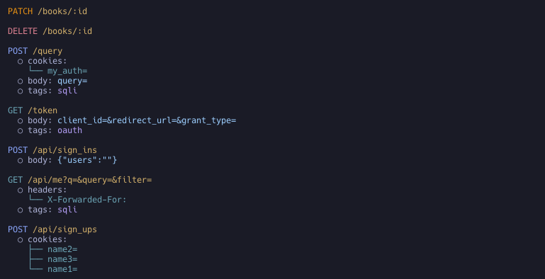

+++
title = "Using the Tagger for Contextual Analysis"
description = "Automatically tag endpoints and parameters to identify potential security risks."
weight = 3
sort_by = "weight"

+++

Automatically add descriptive tags to endpoints and parameters to flag functionality and potential security risks (e.g., SQL injection, authentication endpoints).



## Usage

Tagger is disabled by default.

**Enable all taggers**

```bash
noir -b <BASE_PATH> -T
```

**Enable specific taggers** (list available ones with `noir --list-taggers`)

```bash
noir -b <BASE_PATH> --use-taggers hunt,oauth
```

## Output

Tags appear in the `tags` array at both the endpoint level and the parameter level. Each tag has a `name` (short identifier like `sqli` or `oauth`), a human-readable `description`, and the `tagger` that produced it (e.g., `Hunt` for vulnerability patterns, `Oauth` for authentication flows).

```json
{
  "url": "/query",
  "method": "POST",
  "params": [
    {
      "name": "query",
      "value": "",
      "param_type": "form",
      "tags": [
        {
          "name": "sqli",
          "description": "This parameter may be vulnerable to SQL Injection attacks.",
          "tagger": "Hunt"
        }
      ]
    }
  ],
  "protocol": "http",
  "tags": []
},
{
  "url": "/token",
  "method": "GET",
  "protocol": "http",
  "tags": [
    {
      "name": "oauth",
      "description": "Suspected OAuth endpoint for granting 3rd party access.",
      "tagger": "Oauth"
    }
  ]
}
```
