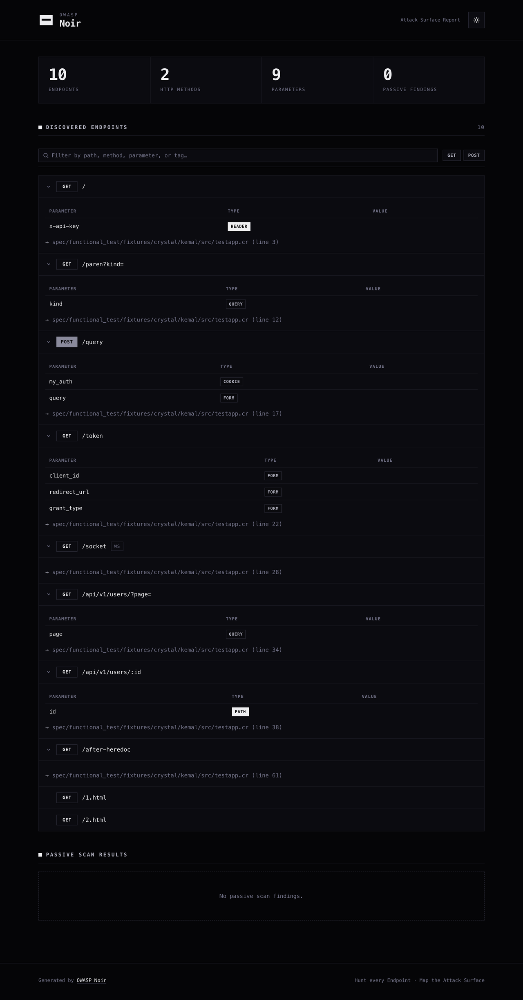
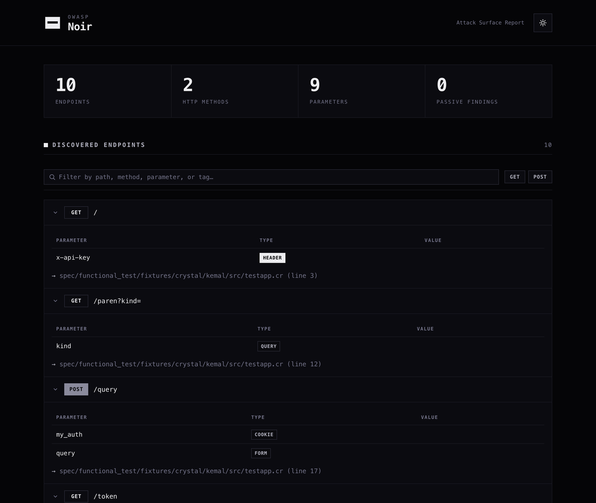

+++
title = "HTML 리포트"
description = "공격 표면 스캔 결과에 대한 시각적인 HTML 보고서를 생성합니다."
weight = 3
sort_by = "weight"

+++

스캔 결과를 시각화한 단독 실행 가능한 인터랙티브 HTML 파일을 생성합니다. 새롭게 디자인된 모노크롬 "noir" 테마를 사용하며, 외부 의존성 없는 단일 파일이라 오프라인에서도 그대로 열리고, 이해관계자와 공유하거나 공격 표면을 리뷰할 때 유용합니다.

## 기본 사용법

```bash
noir scan . -f html -o report.html
```

## 미리보기

아래 스크린샷은 Noir에 포함된 Kemal 테스트 픽스처로 생성한 **실제 리포트**이며, 저장소를 받아 그대로 재현할 수 있습니다.

```bash
noir scan -b spec/functional_test/fixtures/crystal/kemal -f html -o report.html
```



리포트에는 **다크 테마**가 내장되어 있습니다. 우측 상단의 컨트롤로 전환할 수 있으며, 선택한 테마는 `localStorage`에 저장되어 다음에 열 때도 유지됩니다. 처음 열 때는 운영체제의 `prefers-color-scheme` 설정을 따릅니다.



### 리포트 구성

- **대시보드 요약**: 전체 엔드포인트, HTTP 메서드, 파라미터, 패시브 스캔 결과 요약
- **엔드포인트 세부 정보**: 모든 엔드포인트를 접을 수 있는 카드로 표시하며, 그레이스케일 메서드 배지(외곽선 = 안전한 읽기, 회색 = 변경, 검은색 = 삭제)와 WebSocket 등 비-HTTP 엔드포인트를 위한 프로토콜 배지를 함께 제공
- **파라미터 분석**: 엔드포인트별로 각 파라미터의 이름, 타입(query, form, json, header, cookie, path), 값을 보여주는 테이블
- **패시브 스캔 결과**: 패시브 스캐닝(`-P`) 활성화 시 설명, 심각도 배지, 매칭된 코드 스니펫 표시
- **소스 코드 링크**: 각 엔드포인트가 정의된 파일 경로와 줄 번호

### 인터랙티브 기능

리포트는 별도의 서버나 네트워크 없이 단일 HTML 파일만으로 바로 동작합니다.

- 다음 방문 시에도 유지되고 `prefers-color-scheme`를 존중하는 **라이트 / 다크 테마 토글**
- 공격 표면을 빠르게 훑을 수 있도록 세부 정보를 접을 수 있는 **접이식 엔드포인트 카드**
- 경로, 메서드, 파라미터, 태그로 엔드포인트를 거르는 **실시간 검색** (표시/전체 개수 실시간 표시)
- 엔드포인트와 패시브 결과 목록을 좁히는 **메서드·심각도 필터 칩**
- **인쇄 친화적**: 인쇄 시 모든 카드를 펼치고 컨트롤을 숨기며, `prefers-reduced-motion`을 존중

## 템플릿 커스터마이징

브랜딩이나 내부 보고 기준에 맞게 자체 템플릿을 사용할 수 있습니다.

### 템플릿 위치

Noir는 아래 경로에서 `report-template.html` 파일을 찾습니다.

- **Linux/macOS**: `~/.config/noir/report-template.html`
- **Windows**: `%APPDATA%\noir\report-template.html`
- **Custom Home**: `NOIR_HOME`이 설정된 경우 `$NOIR_HOME/report-template.html`

이 파일이 있으면 내장 기본 템플릿 대신 사용됩니다.

### 플레이스홀더

템플릿에서 아래 플레이스홀더를 사용하면 Noir가 생성된 콘텐츠로 대체합니다.

| 플레이스홀더 | 설명 |
| :--- | :--- |
| `<%= noir_head %>` | 기본 CSS, 메타데이터, 페인트 전 테마 초기화 스크립트를 포함한 `<head>` 태그 내용 |
| `<%= noir_header %>` | 제목, 브랜드 마크, 테마 토글이 포함된 헤더 섹션 |
| `<%= noir_summary %>` | 요약 대시보드 (카운트 카드) |
| `<%= noir_endpoints %>` | 검색창과 메서드 필터 칩을 포함한, 발견된 엔드포인트 목록 섹션 |
| `<%= noir_passive_scans %>` | 패시브 스캔 결과 섹션 |
| `<%= noir_footer %>` | 푸터 섹션 |
| `<%= noir_scripts %>` | 인터랙티브 스크립트 (테마 토글, 접이식 카드, 검색, 필터) |


noir_scripts 플레이스홀더를 잊지 마세요. 템플릿의 닫는 body 태그 바로 앞에 추가하면 됩니다. 없어도 리포트는 렌더링되지만 테마 토글, 접이식 카드, 검색, 필터 칩이 동작하지 않습니다.


### 예제 템플릿

아래는 회사 헤더를 추가하면서 Noir의 기본 스타일과 콘텐츠 섹션, 인터랙티브 기능을 `<%= %>` 플레이스홀더로 재사용하는 간단한 예제입니다.

```html
<!DOCTYPE html>
<html lang="en">
<head>
    <!-- 기본 스타일 및 페인트 전 테마 초기화 스크립트 포함 -->
    <%= noir_head %>
    <style>
        /* 사용자 정의 스타일 추가 */
        body { background-color: #f0f2f5; }
        .company-header { padding: 20px; text-align: center; background: #333; color: #fff; }
    </style>
</head>
<body>
    <div class="company-header">
        <h1>My Company Security Report</h1>
    </div>

    <!-- 원래 헤더 -->
    <%= noir_header %>

    <main class="container">
        <!-- 요약 섹션 -->
        <%= noir_summary %>

        <h2>Detailed Findings</h2>

        <!-- 엔드포인트 목록 -->
        <%= noir_endpoints %>

        <!-- 패시브 스캔 결과 -->
        <%= noir_passive_scans %>
    </main>

    <%= noir_footer %>

    <!-- 인터랙티브 기능: 테마 토글, 접이식 카드, 검색, 필터 -->
    <%= noir_scripts %>
</body>
</html>
```

이 파일을 `~/.config/noir/report-template.html`에 배치하면 이후 모든 보고서에 이 레이아웃이 적용됩니다.
