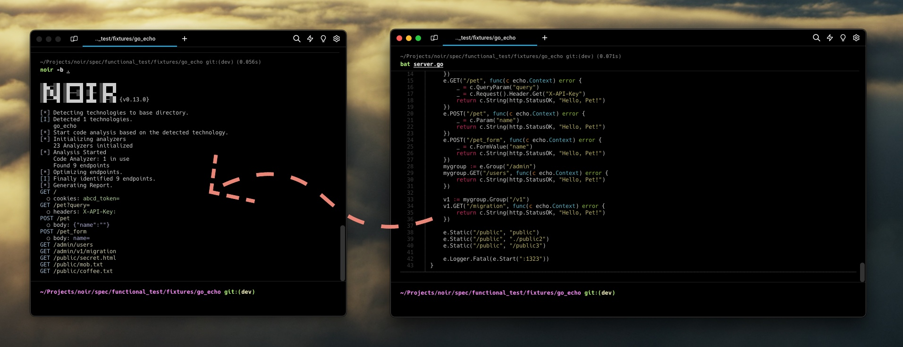
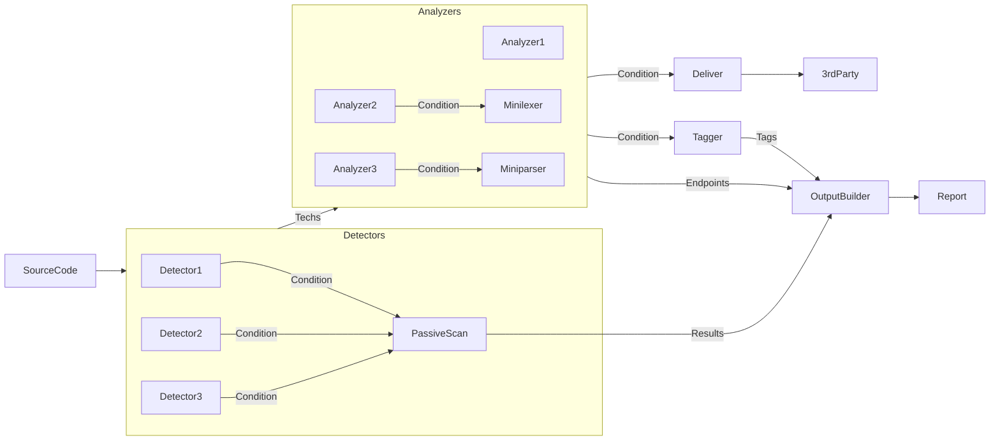

# Secure Every Endpoint.
{: .fs-9 }

OWASP Noir is an open-source project, specializing in identifying attack surfaces for enhanced whitebox security testing and security pipeline.
{: .fs-6 .fw-300 }

[Get started now](./get_started/installation/){: .btn .btn-blue }
[Github](https://github.com/owasp-noir/noir){: .btn }
[OWASP](https://owasp.org/www-project-noir){: .btn }

---

## What is noir?

Noir is an open-source project dedicated to identifying attack surfaces, enhancing whitebox security testing, and optimizing security pipelines. It excels at discovering API endpoints, web endpoints, and other potential entry points within source code for comprehensive security analysis.

This tool was developed using [Crystal](https://crystal-lang.org). Initially started as hahwul's personal project[^1] in August 2023, it became an OWASP project[^2] in June 2024, co-led by [hahwul](https://github.com/hahwul) and [ksg](https://github.com/ksg97031).

[^1]: [Hello Noir 👋🏼](https://www.hahwul.com/2023/08/03/hello-noir/)
[^2]: [Welcome to OWASP Noir](https://github.com/orgs/owasp-noir/discussions/336)

## How it works?

Noir is composed of several key components: detector, analyzer, deliver, minilexer/miniparser[^3], output-builder, and passive-scan & tagger[^4]. These components interact and work together to effectively analyze source code. Through this process, they help identify endpoints, parameters, headers, and more within the source code.

[^3]: The minilexer and miniparser is a parser and tokenizer used for code analysis to identify various elements within the source code. 
[^4]: The tagger assigns relevant tags to the identified issues for easier categorization and management.

## About the project
### License
OWASP Noir is distributed by an [MIT license](https://github.com/owasp-noir/noir/blob/main/LICENSE).

### Contributing

Open-source projects thrive on the strength of the community. From small contributions to major ones, we want to express our gratitude to all contributors. If you're interested in contributing, please check out this document.

We believe every contribution counts and appreciate the time and effort you put into making this project better. Whether you're fixing a typo, adding a new feature, or improving documentation, your help is invaluable. Thank you for being part of our community!

To get started, simply follow the guidelines in the [Contribute Guide](https://github.com/owasp-noir/noir/blob/main/CONTRIBUTING.md). It's full of helpful tips and instructions to make your first contribution smooth and enjoyable.

Happy contributing!

#### Thank you to the contributors of Noir ♥️

### Code of Conduct
OWASP Noir is committed to fostering a welcoming community.

View our [Code of Conduct](https://github.com/owasp-noir/noir/blob/main/CODE_OF_CONDUCT.md) on our GitHub repository.

## Help and feedback

We always welcome feedback. Please share your thoughts, suggestions, or report any issues via the GitHub [discussions](https://github.com/orgs/owasp-noir/discussions) or [issues](https://github.com/owasp-noir/noir/issues) page.