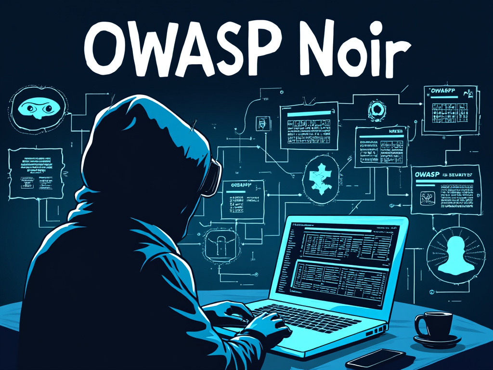

## Noir documentation

OWASP Noir is an open-source project, specializing in identifying attack surfaces for enhanced whitebox security testing and security pipeline.

[Get started now](./get_started/installation/){: .btn .btn-blue }
[Github](https://github.com/owasp-noir/noir){: .btn }
[OWASP](https://owasp.org/www-project-noir){: .btn }

