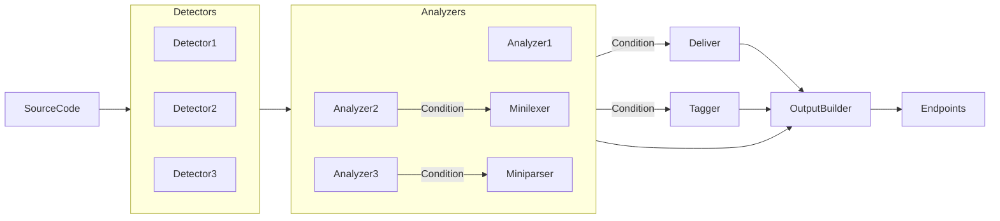

## What is noir?
Noir is an open-source project specializing in identifying attack surfaces for enhanced whitebox security testing and security pipeline. This includes the capability to discover API endpoints, web endpoints, and other potential entry points within source code for thorough security analysis.

## How it works?

Noir is composed of several key components: detector, analyzer, deliver, minilexer, output-builder, and tagger. These components interact and work together to effectively analyze source code. Through this process, they help identify endpoints, parameters, headers, and more within the source code.

## How to contribute?

Open-source projects thrive on the strength of the community. From small contributions to major ones, we want to express our gratitude to all contributors. If you're interested in contributing, please check out this document.

We believe every contribution counts and appreciate the time and effort you put into making this project better. Whether you're fixing a typo, adding a new feature, or improving documentation, your help is invaluable. Thank you for being part of our community!

To get started, simply follow the guidelines in the [Contribute Guide](https://github.com/owasp-noir/noir/blob/main/CONTRIBUTING.md). It's full of helpful tips and instructions to make your first contribution smooth and enjoyable.

Happy contributing!