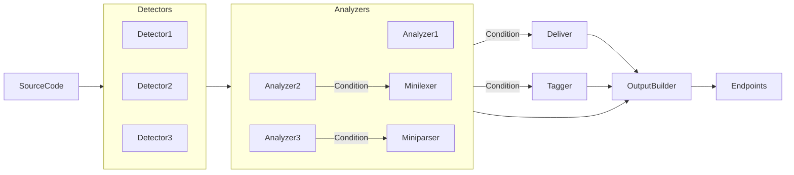

## What is noir?
Noir is an open-source project specializing in identifying attack surfaces for enhanced whitebox security testing and security pipeline. This includes the capability to discover API endpoints, web endpoints, and other potential entry points within source code for thorough security analysis.

## How it works?

Noir is composed of several key components: detector, analyzer, deliver, minilexer, output-builder, and tagger. These components interact and work together to effectively analyze source code. Through this process, they help identify endpoints, parameters, headers, and more within the source code.

